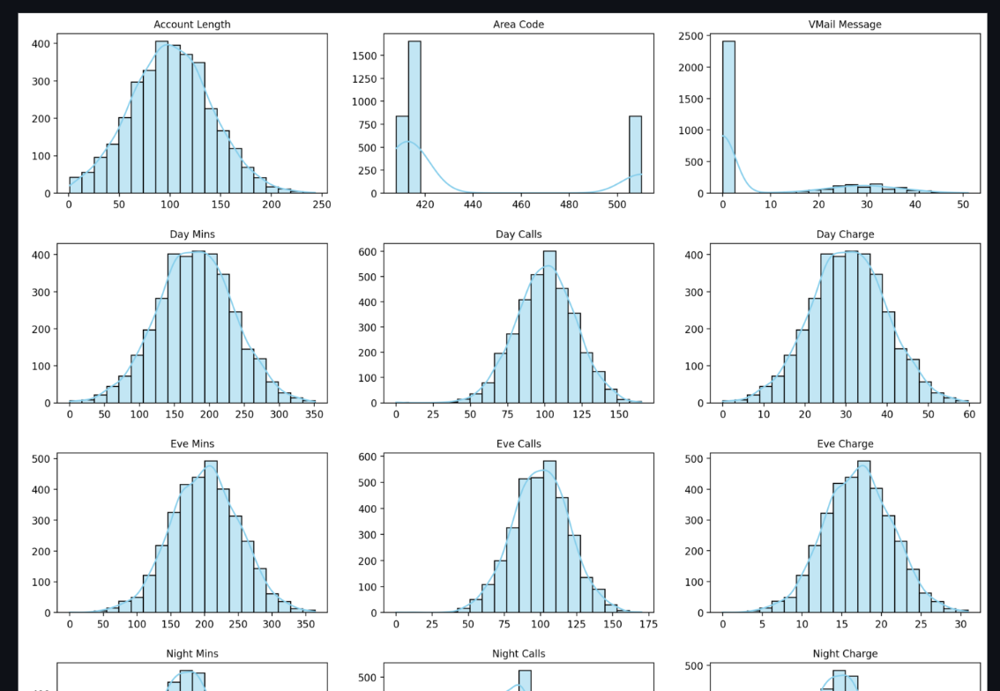
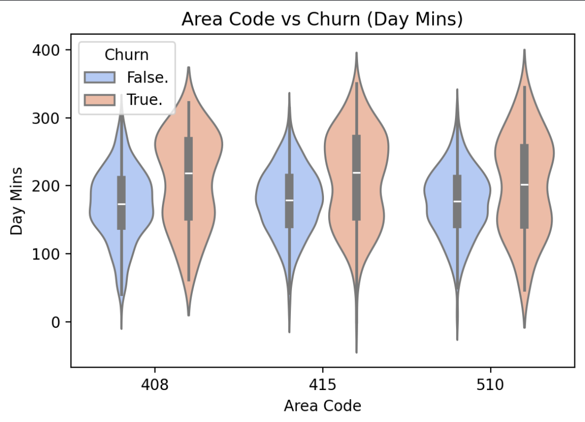
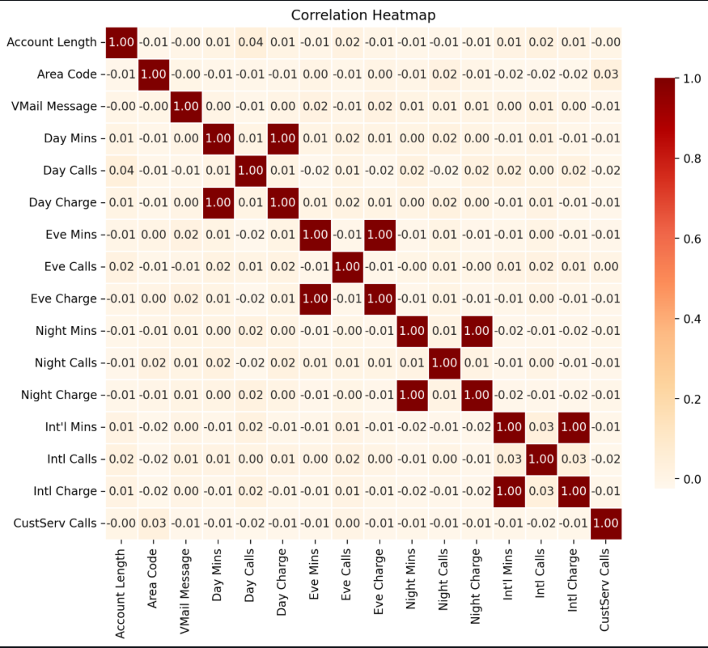
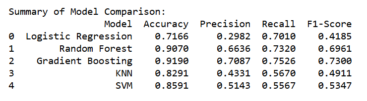
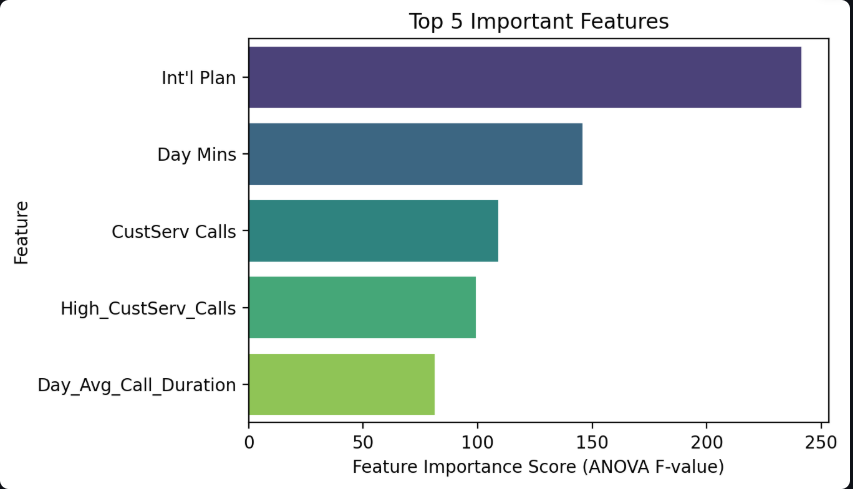
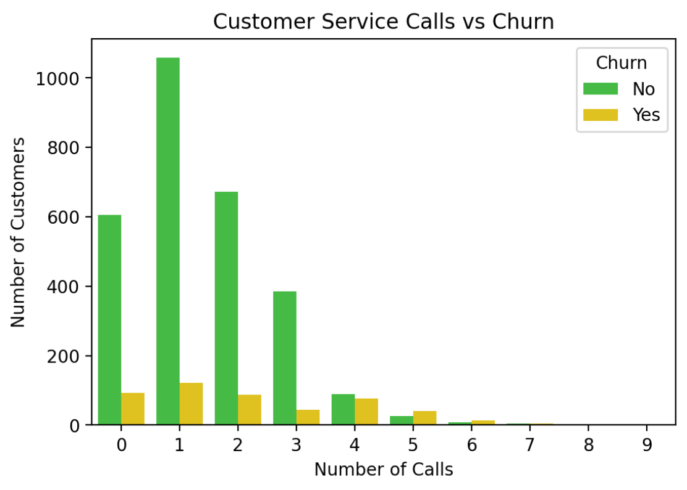

# Customer Churn Analysis and Prediction

---

## Dataset Overview

- **File:** `data/churn_modified.csv`
- **Records:** 3333 customer records
- **Features:** 21 features, including customer demographics, call usage, and service plan information

---

## Key Steps Before Model Training

1. **Initial Data Checks**
   - Checked dataset **shape** and **info**
   - Checked for **null values** and **duplicates**
   - Observed **class imbalance** in `Churn` (~14.5% churned)

2. **Outlier Handling**
   - Handled outliers using **IQR capping**

3. **Categorical Encoding**
   - Converted categorical columns to numerical using **Label Encoding**

4. **Feature Engineering**
   - Calculated **average call duration** for Day, Eve, Night, and International calls  
   - Created a **binary flag for high customer service calls** (`High_CustServ_Calls`)

5. **Redundant Column Removal**
   - Dropped columns causing multicollinearity or redundancy

6. **Visualization**
   - Visualized distributions, outliers, and feature-target relationships

> These steps ensured the dataset was clean, well-prepared, and ready for **model training and analysis**.

---

## Insights

### Distribution of Numeric Features

### Area Code vs Churn (Violin Plot)

### Correlation Heatmap (Numerical Features)

---

## Model Implementation and Comparison

1. **Train-Test Split**
   - Split the dataset into **training (80%)** and **testing (20%)** sets

2. **Handling Imbalanced Data**
   - Applied **SMOTE (Synthetic Minority Oversampling Technique)** on the training set to handle class imbalance

3. **Models Compared**
   - Logistic Regression  
   - Random Forest  
   - Gradient Boosting  
   - K-Nearest Neighbors (KNN)  
   - Support Vector Machine (SVM)

### Model Performance Summary

**Gradient Boosting** emerged as the **best-performing model** 🔥  
showing the **highest Accuracy (91.9%)**, **Precision (70.8%)**, **Recall (75.3%)**, and **F1-Score (73.0%)** —  
indicating a well-balanced and reliable model for **Customer Churn Prediction**.

---

## More Insights

### Top 5 Features Contributing to Customer Churn

### Customer Service Calls vs Churn

## Key Findings

1. The **top 5 features contributing to churn** are:  
   - Int'l Plan  
   - Day Mins  
   - CustServ Calls  
   - High_CustServ_Calls  
   - Day_Avg_Call_Duration  

2. The **best model** for predicting customer churn in this dataset is **Gradient Boosting**.

---

## Author

**Ashutosh Sahoo**  
Email: [sahooashutosh792@gmail.com](mailto:sahooashutosh792@gmail.com)
