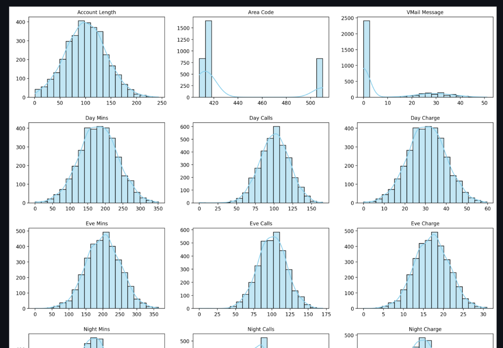
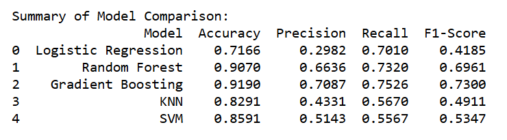
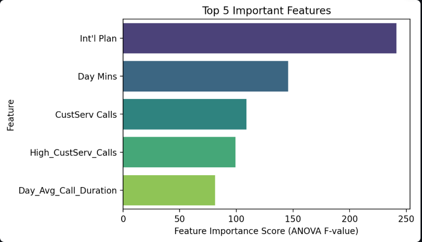
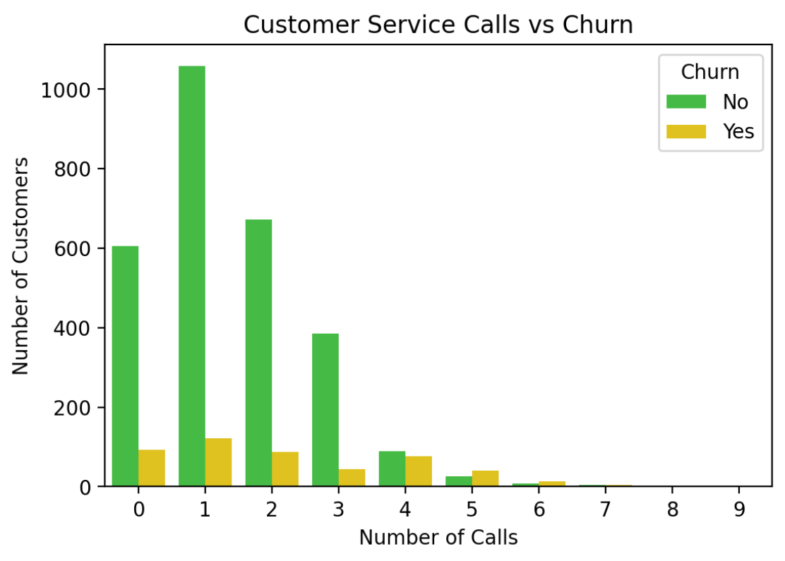

# Customer Churn Analysis and Prediction

[🔗 Live Streamlit App](https://customerchurnanalysisandprediction-vytvdffnz8j6mjwzgyvgcd.streamlit.app/)

---

## Dataset Overview

The dataset consists of telecom customer information including demographic data, account information, and service usage metrics. It contains features like `State`, `Area Code`, `Customer Service Calls`, `Day Minutes`, `Night Minutes`, and several others that help analyze customer behavior and churn tendencies.  

After preprocessing, the dataset was transformed to handle missing values, encode categorical variables, and prepare it for modeling.

---

## Data Preprocessing & Feature Engineering

- **Handling Missing Values:** Checked and handled missing entries in relevant columns to ensure clean input for modeling.  
- **Feature Encoding:** Converted categorical features such as `Int'l Plan` and `Voice Mail Plan` to numeric or dummy variables.  
- **Feature Scaling & Transformation:** Normalized and standardized numeric features where necessary for better model performance.  
- **Dataset Splitting:** Divided the data into training, validation, and test sets for model evaluation.  

These steps ensured the dataset was clean, well-prepared, and ready for model training and analysis.

---

## Insights

### Distribution of Numeric Features

### Area Code vs Churn (Violin Plot)
.png)

### Correlation Heatmap (Numerical Features)
.png)

---

## Model Implementation and Comparison

### Model Performance Summary

**Gradient Boosting** emerged as the **best-performing model** 🔥  
showing the **highest Accuracy (91.9%)**, **Precision (70.8%)**, **Recall (75.3%)**, and **F1-Score (73.0%)** —  
indicating a well-balanced and reliable model for **Customer Churn Prediction**.  

Models compared:  
- Logistic Regression  
- Random Forest  
- Gradient Boosting  
- K-Nearest Neighbors (KNN)  
- Support Vector Machine (SVM)  

---

## More Insights

### Top 5 Features Contributing to Customer Churn

### Customer Service Calls vs Churn

